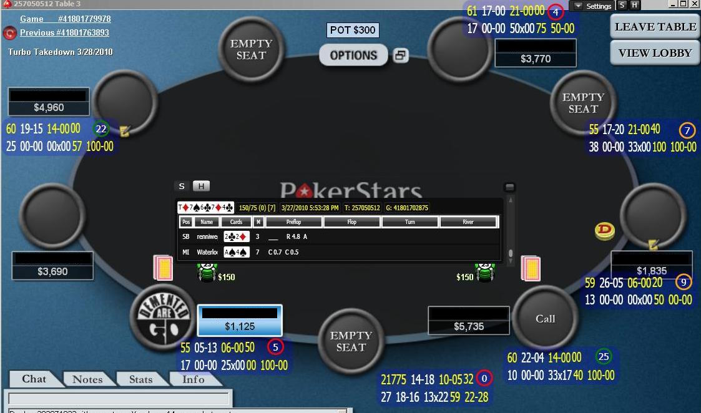
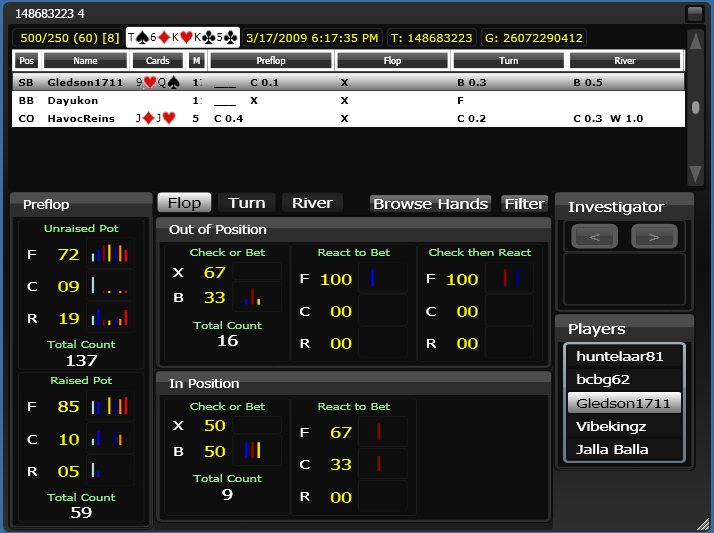
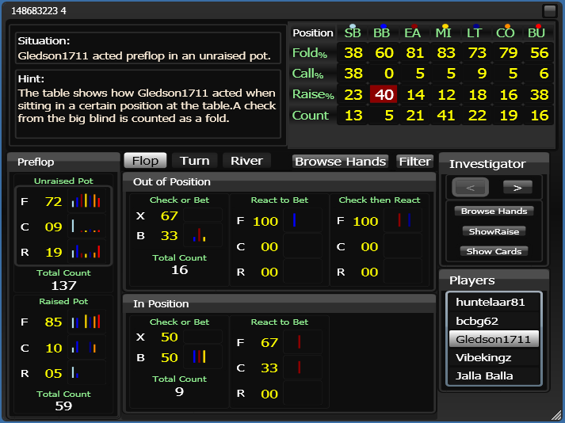
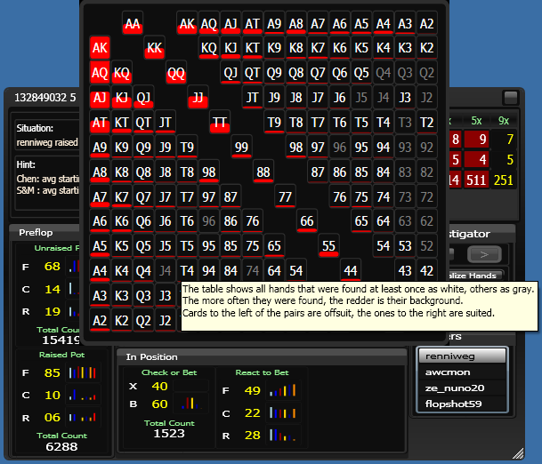

# PokerTell

Gathers information about your online poker opponents and presents it as an interactive overlay on top of the poker
table.

## History and Features

This is a project I worked on for about 2 years in order to get back into programming and try to create something that
would make me a lot of money.

It is about 95% done but before I released it, I got a job and totally side tracked with so many interesting things that
opened up for me and I wanted to learn about. Therefore this has been neglected for over 4 years. At this point I don't
even own a proper Windows machine anymore and doubt that I ever get back to working on it.

Therefore I decided to give up on the *making lots of money* idea and open source it instead.
I hope others can use/learn from it and/or possibly continue development on it.

Since back then I didn't know what MVP means I was aiming to implement lots of features before releasing a first
version. As a result PokerTell has a plethora of features at this point, some of which I'll list here *keep in mind that
some of these may no longer work due to changes in the poker software it integrates with*:

- ability to import histories from PokerTracker
- supports Sqlite, MySql and Postgres databases
- works with PokerStars and mostly with FullTilt poker rooms
- ability to walk memory to track hands of PokerStars tables you aren't even sitting on (via an included plugin)
- succinct hand history review visual
- clickable opponent statistics which can be drilled into until narrowed down to hand histories matching the behavior in
  question
- *drilling in* action occurs entirely on table you're sitting on without any extra windows needed in order to keep you
  focused on the game
- game review feature with *send email* support
- automatic poker room detection
- automatically attaches overlay to tables you join

## Status

As far as I know PokerTell compiled and ran properly the last time I worked on it. There are some open issues which I
merged from the original repository into this one. As far as I know I was in the middle of supporting FullTilt and
making this work for all mentioned databases on the `dev` branch.

If you have any questions getting this to compile/run please file an issue, however I most likely won't be able to help
you for above stated reason. An issue is still useful though since others that are dabbling with it may be able to help.

## LICENSE

I'm releasing this under the GNU General Public License, version 3 (GPL-3.0) license in order to keep all work that is
added open source.
